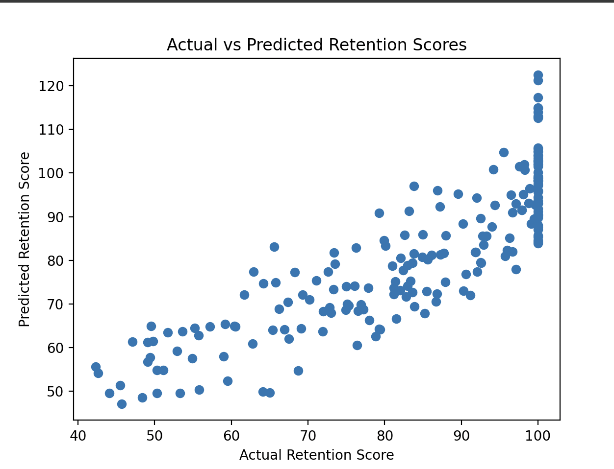

# Memory Performance Prediction Model

## Overview

This project uses a neural network (ANN) to predict memory retention scores based on study habits. The dataset contains features like:
- **TimeSinceStudy**: The number of days since a student last studied.
- **Repetitions**: The number of repetitions of the study material.
- **StudyTime**: The time spent studying in minutes.
- **Difficulty**: The difficulty level of the study material (categorical: Easy, Medium, Hard).

The goal of this project is to predict the **RetentionScore** based on these features using an Artificial Neural Network.

## Dataset

The dataset is synthetically generated and includes the following features:
- `TimeSinceStudy`: Number of days since the student last studied.
- `Repetitions`: Number of repetitions of study material.
- `StudyTime`: Time spent studying (in minutes).
- `Difficulty`: Categorical variable for the difficulty of the material.
- `RetentionScore`: Target variable indicating the retention score (0-100).

The dataset is generated in `dataset.py` and saved to a CSV file (`Memory_Performance.csv`).

## Project Structure

```bash
Mem-Performance/
│── dataset.py          #generates the synthetic dataset
│── mem.py              #loads dataset, trains the model, evaluates performance
│── Memory_Performance.csv  #generated dataset
│── requirements.txt    #dependencies for running the project
│── graph.png           #visualization of actual vs predicted retention scores
│── README.md           #project documentation
```

## Files

- `dataset.py`: This script generates a synthetic dataset with the features mentioned above.
- `mem.py`: This script loads the dataset, preprocesses it, builds and trains the neural network model, and evaluates its performance.

## Installation

1. Clone the repository to your local machine:
```bash
git clone https://github.com/karadeskin/Mem-Performance.git
```

2. Navigate to the project folder:
```bash
cd Mem-Performance
```

3. Create and activate a virtual environment (optional but recommended):
```bash
python3.10 -m venv venv
source venv/bin/activate  #macOS/Linux
venv\Scripts\activate  #Windows
```

4. Install the required dependencies: 
```bash
pip install -r requirements.txt
```

## Usage

### Step 1: Generate the Dataset

Run `dataset.py` to generate the synthetic dataset:
```bash
python3 dataset.py #macOS/Linux
python dataset.py #Windows
```

### Step 2: Train and Evaluate the Model 

Run mem.py to load the dataset, preprocess the data, and train the neural network model:
``` bash
python3 mem.py #macOS/Linux
python mem.py #Windows 
```
## Model Evaluation

The model is evaluated using **Mean Squared Error (MSE)**:

- **MSE** measures the average squared difference between actual and predicted retention scores. A lower value indicates better model accuracy. The model achieved an **MSE value of 67.87** after training, indicating a good fit for predicting memory retention scores.
- The artificial neural network consists of:
  * Input layer (4 features)
  * Two hidden layers (6 neurons each, ReLU activation)
  * Output layer (predicts retention score)

## Graph: Actual vs. Predicted Retention Scores

Below is a scatter plot showing the relationship between actual and predicted retention scores in the memory performance model:



## Future Improvements 

* Add more advanced model architectures.
* Incorporate more features and real-world data.
* Experiment with hyperparameter tuning.

## Acknowledgements 

* TensorFlow and Keras for providing the neural network framework.
* scikit-learn for data preprocessing and model evaluation tools.
